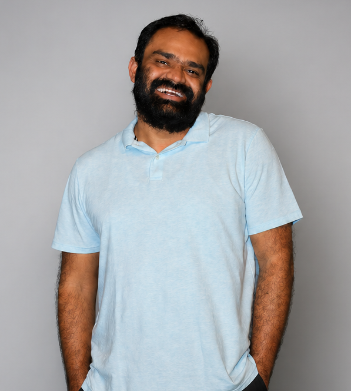

:::{layout-ncol="2" .column-page-inset}

:::{.column}

:::

:::{.column}
I am Ayush, an independent researcher interested in data, political economy, and development. My work spans experimental and non-experimental research, data analytics, and teaching data analysis skills. I am an adept R programmer with experience in developing web apps, reproducible workflows, and data pipelines. 

I am affiliated with the [Oxford Poverty and Human Development Initiative](https://ophi.org.uk/) as a Researcher. For OPHI, I built, and now maintain the [Global Multidimensional Poverty Index databank](https://trainingidn.shinyapps.io/OPHIDataBankGlobalComparison/).

If you share similar interests and want to collaborate on a project, feel free to reach out. I am also available for training or consultancy needs in areas related to data analysis, policy, and development.
:::

:::